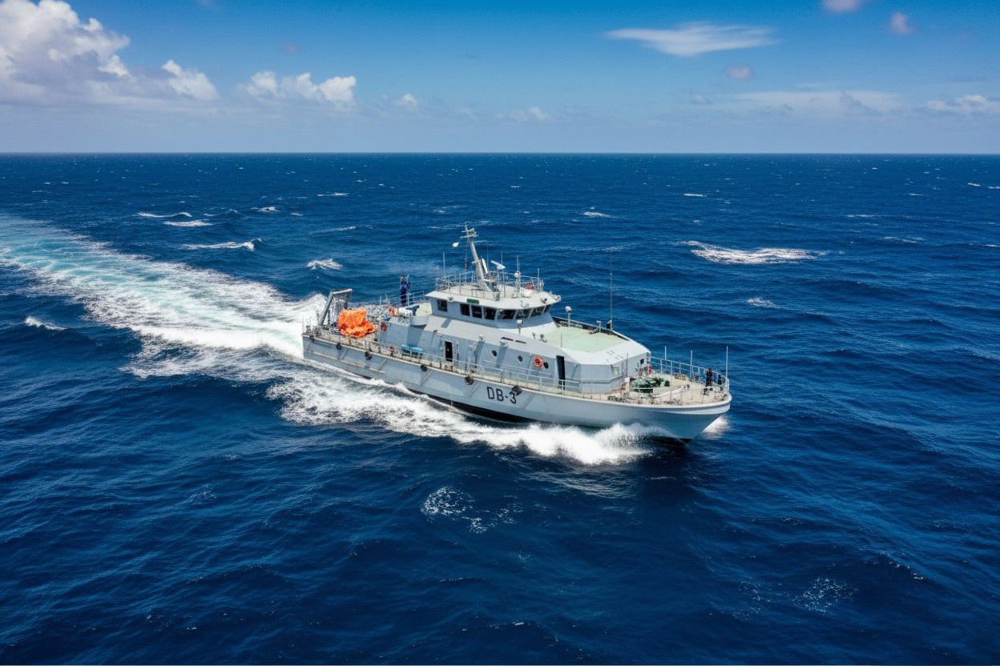

# 🤿 Diving Boat (DB)

  

<h2 align="center">03 × Diving Boat (DB)</h2>

<b>Bangladesh Navy (BN)</b> 
Naval Architect | Design Review | Design Management | Construction Support

---

## 📌 Project Summary

Participated in the successful delivery of **03 Steel Mono Hull Diving Boats** for the **Bangladesh Navy**. The vessels were designed to support **diving operations, diver training, emergency diving treatment, underwater inspection, and transportation of divers and equipment** for port channels, coastal waters, and inland waterways.

My responsibilities included **design review, design management, engineering coordination, and construction support**, ensuring compliance with contractual specifications, Bureau Veritas (BV) classification requirements, and project quality standards throughout design, construction, sea trials, and final delivery.

| **Client** | Bangladesh Navy (BN) |
|:-----------|:---------------------|
| **Vessel Type** | Diving Boat |
| **Quantity** | 03 Boats |
| **Hull Type** | Steel Mono Hull |
| **Classification** | Bureau Veritas (BV) |
| **Role** | Naval Architect |
| **Scope** | Design Review • Design Management • Engineering Coordination • Construction Support |
| **Delivery** | 2021 |

---

## 📐 Principal Particulars

| Parameter | Value |
|:----------|------:|
| Length Overall (LOA) | **38.9 m** |
| Breadth (Max) | **9.0 m** |
| Maximum Speed | **Not Less Than 15 knots** |

---

## 👨‍💼 Engineering Contributions

- Performed comprehensive design review against contract specifications and Bureau Veritas class requirements.
- Managed engineering documentation, design revisions, and interdisciplinary coordination throughout the project.
- Reviewed hull structural, machinery, outfitting, piping, electrical, and production drawings.
- Ensured compliance with classification rules, statutory regulations, and Bangladesh Navy technical requirements.
- Coordinated technical activities between designers, production teams, client representatives, and classification surveyors.
- Provided engineering support during construction, inspections, harbour acceptance tests, sea trials, and vessel commissioning.
- Assisted in resolving technical issues during fabrication and outfitting to maintain project schedule and quality.
- Supported final documentation, delivery acceptance, and project close-out activities.

---

## ⭐ Technical Expertise Demonstrated

**Design Review • Design Management • Engineering Coordination • Steel Ship Structures • Diving Support Vessel Engineering • Bureau Veritas Compliance • Production Engineering • Technical Documentation • Construction Support • Sea Trials • Commissioning • Quality Assurance**

---

## 💻 Engineering Software

**AVEVA Marine • Maxsurf • Rhino3D • AutoCAD • ANSYS**

---

## 📷 Project Gallery

<table align="center">
<tr>

<td align="center">
 
<b>Construction Phase</b>
</td>

<td align="center">
 
<b>Sea Trials & Delivery</b>
</td>

</tr>
</table>

---

## 📬 Contact

**Md. Ariful Islam**

**Senior Naval Architect | Ship Design | Structural Engineering | Design Management | Project Management | Classification Compliance**

📧 ariful.buet1985@gmail.com

💼 https://linkedin.com/in/islam-mdariful
